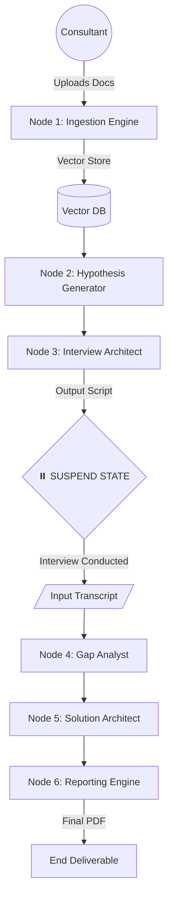

Here is the complete project documentation in Markdown (`.md`) format, incorporating the specific **Consultant Graph** architecture as requested.

```markdown
# Project Specification: Agentic Process Improvement Consultant (APIC)

**Version:** 1.0  
**Date:** January 2026  
**Document Type:** Master Technical Specification & Product Backlog

---

# PART I: TECHNICAL DOCUMENTATION

## 1. System Overview
**Name:** APIC (Agentic Process Improvement Consultant)  
**Purpose:** An autonomous multi-agent system designed to act as a digital management consultant. It ingests corporate data, identifies operational inefficiencies, conducts "Human-in-the-Loop" validation via interview scripts, and generates actionable automation roadmaps.  
**Core Philosophy:** "Reality-Grounded AI." The system does not hallucinate improvements based solely on theory; it validates hypotheses through human feedback before solutioning.

---

## 2. Architectural Design (The "Consultant Graph")

We will use a **State Graph architecture** (best implemented with **LangGraph** in Python). This allows the system to manage complex dependencies and, critically, "pause" execution to wait for the customer interview.

### 2.1 The Workflow Logic (State Machine)

The system is designed as a directed graph where each node represents a distinct agentic responsibility.

* **Node 1: Knowledge Ingestion (RAG)** * *Action:* Indexes company PDFs, SOPs, and URLs.  
    * *Output:* Vectorized knowledge base (Long-term memory).
* **Node 2: Hypothesis Generator** * *Action:* AI analyzes the ingested data to "guess" where inefficiencies lie (Process Mining).  
    * *Output:* List of suspected bottlenecks and "Hidden Factories."
* **Node 3: Interview Architect** * *Action:* Generates a dynamic, role-specific question script based on the hypotheses.  
    * *Output:* JSON/Text Interview Script.
    
    > **⏸️ HUMAN BREAKPOINT (State Suspension)** > *The system pauses here. The consultant conducts the interview with the client. The consultant then feeds the transcript/notes back into the system to resume execution.*

* **Node 4: Gap Analyst** * *Action:* Compares **SOPs** (how they *say* they work) vs. **Transcript** (how they *actually* work).  
    * *Output:* A structured table of verified pain points.
* **Node 5: Solution Architect** * *Action:* Maps identified gaps to specific AI/Automation tools (e.g., "Manual Entry" -> "OCR Agent").  
    * *Output:* Technical implementation plan with ROI estimates.
* **Node 6: Reporting Engine** * *Action:* Compiles all data into a professional deliverable.  
    * *Output:* Final PDF Report / Business Case.

### 2.2 Visual Representation



---

## 3. Technology Stack Strategy

| Component | Technology | Justification |
| --- | --- | --- |
| **Orchestration** | **LangGraph** (Python) | Essential for the "Human Breakpoint" (State persistence) and cyclic workflows. |
| **LLM Inference** | **GPT-4o** or **Claude 3.5 Sonnet** | High reasoning capability required for nuance detection in transcripts and complex strategy. |
| **Backend API** | **FastAPI** | Async support is critical for handling long-running AI tasks. |
| **Vector DB** | **Pinecone** (Serverless) | Scalable RAG storage with "Namespaces" to isolate data per company. |
| **Database** | **PostgreSQL** | Relational storage for User Auth, Project Metadata, and State history. |
| **Frontend** | **Next.js** or **Streamlit** (MVP) | Reactive UI to handle file uploads and streaming text responses. |

---

## 4. Data Models (Schema Definition)

To ensure agents communicate effectively, we enforce strict Pydantic models.

### A. The Interview Script (Output of Node 3)

```python
class InterviewScript(BaseModel):
    project_id: str
    target_departments: List[str]
    questions: List[Dict[str, str]] 
    # Example: {"role": "CFO", "q": "How do you approve invoices?", "intent": "Find bottlenecks"}

```

### B. The Gap Analysis (Output of Node 4/5)

```python
class AnalysisResult(BaseModel):
    process_step: str
    observed_behavior: str
    pain_point_severity: Literal["Low", "Medium", "High"]
    proposed_solution: str
    tech_stack_recommendation: List[str]
    estimated_roi_hours: int

```

---

# PART II: PRODUCT BACKLOG

This backlog is prioritized for development.
**Priorities:** P0 (MVP/Critical), P1 (Beta), P2 (Polishing).

## EPIC 1: Foundation & Ingestion (Nodes 1 & 2)

**Goal:** Infrastructure to read, understand, and hypothesize.

| ID | Priority | User Story | Acceptance Criteria |
| --- | --- | --- | --- |
| **STOR-1.1** | **P0** | As a User, I want to create a "Client Project" to isolate data. | 1. System generates unique `project_id`.<br>

<br>2. Vector DB creates namespace `client_{id}`. |
| **STOR-1.2** | **P0** | As a User, I want to upload PDF/DOCX files. | 1. Multi-file upload supported.<br>

<br>2. Files parsed via `Unstructured.io` or `LlamaParse`.<br>

<br>3. Text chunked and embedded in Vector DB. |
| **STOR-1.3** | **P0** | As a System, I want to generate initial hypotheses from documents. | 1. Agent scans docs for keywords (manual, email, paper, delay).<br>

<br>2. Agent outputs list of "Suspected Inefficiencies". |

## EPIC 2: The Interview Loop (Node 3 & Breakpoint)

**Goal:** Generate the script and handle the "Pause".

| ID | Priority | User Story | Acceptance Criteria |
| --- | --- | --- | --- |
| **STOR-2.1** | **P0** | As a User, I want a generated Interview Script based on the docs. | 1. Output is JSON formatted.<br>

<br>2. Questions target "Dull, Dirty, Dangerous" tasks.<br>

<br>3. Questions reference specific entities found in docs. |
| **STOR-2.2** | **P0** | As a System, I must pause execution and save state after script generation. | 1. LangGraph state is serialized to Postgres.<br>

<br>2. System waits indefinitely for `/resume` signal. |
| **STOR-2.3** | **P1** | As a User, I want to edit the script before interviewing. | 1. UI allows adding/removing questions.<br>

<br>2. Edited script is saved to context. |

## EPIC 3: Analysis & Solutioning (Nodes 4 & 5)

**Goal:** The intelligent mapping of problems to solutions.

| ID | Priority | User Story | Acceptance Criteria |
| --- | --- | --- | --- |
| **STOR-3.1** | **P0** | As a User, I want to input the Interview Transcript to resume the project. | 1. Upload text/audio transcript.<br>

<br>2. System retrieves previous state (`project_id`). |
| **STOR-3.2** | **P0** | As a System, I want to perform Gap Analysis (SOP vs Transcript). | 1. Agent identifies contradictions.<br>

<br>2. Agent classifies tasks as "Automatable" or "Human-Only". |
| **STOR-3.3** | **P0** | As a System, I want to recommend tech stacks for each gap. | 1. Agent maps gaps to tools (e.g., UiPath, Python, Zapier).<br>

<br>2. Agent estimates complexity (High/Med/Low). |

## EPIC 4: Reporting (Node 6)

**Goal:** The final client deliverable.

| ID | Priority | User Story | Acceptance Criteria |
| --- | --- | --- | --- |
| **STOR-4.1** | **P1** | As a User, I want a generated PDF Report. | 1. Includes Executive Summary.<br>

<br>2. Includes "Current vs Future State" table.<br>

<br>3. Professional formatting. |
| **STOR-4.2** | **P2** | As a User, I want an ROI Calculation table. | 1. Formula: `(Hours Saved * Hourly Rate) - Implementation Cost`. |

---

## Development Roadmap (Suggested)

1. **Sprint 1 (The Skeleton):** Setup FastAPI, LangGraph, and Node 1 (Ingestion). Ensure a PDF can be queried.
2. **Sprint 2 (The Investigator):** Build Node 2 & 3. Implement the "State Pause" mechanism.
3. **Sprint 3 (The Brain):** Build Node 4 & 5. Focus on the prompt engineering for "Gap Analysis."
4. **Sprint 4 (The Closer):** Build Node 6 (PDF generation) and frontend polish.

```

```
